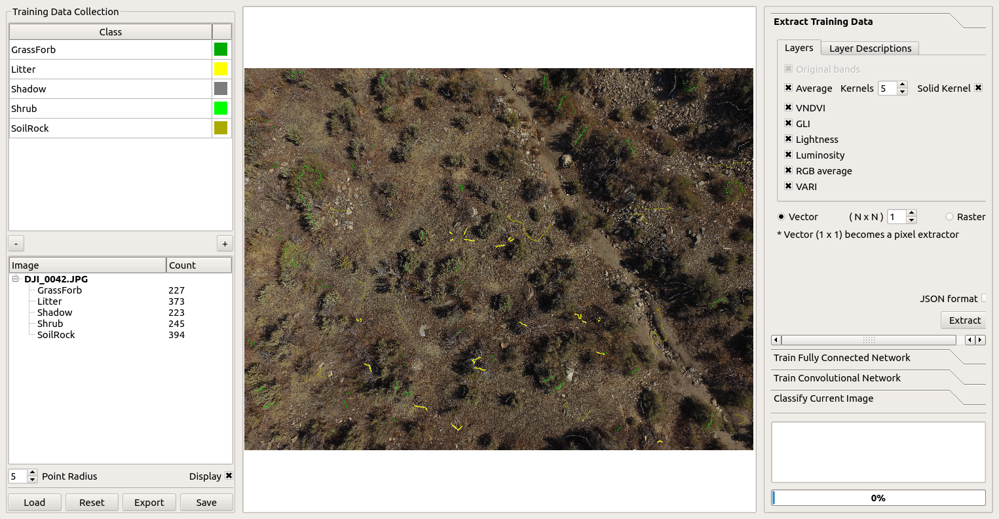

# Nenetic
The Neural Network Image Classifier (Nenetic) is an open source tool written in Python to label image pixels with discrete classes to create products such as land cover maps. The user interface is designed to facilitate a workflow that involves selecting training data locations, extracting training data using original image pixel data and computed features, building models, and classifying images. The current version works with 3-band images such as those acquired from typical digital cameras.





## Installation

### Dependencies
Nenetic is being developed on Ubuntu 20.04 with the following libraries:

* PyQt5 (5.15.1)
* TKinter (3.6.7)
* Pillow (8.0.1)
* Numpy (1.19.5)
* Scipy (1.5.4)
* Tabulate (0.8.9)
* Psutil (5.7.3)
* Tensorflow (2.4.0)

Virtual Environment Setup:
``` bash
cd %nenetic workspace%

[Linux] 
python3 -m venv nenetic-env
source nenetic-env/bin/activate
 
[Windows] 
python -m venv nenetic-env
nenetic-env\Scripts\activate


python -m pip install pip --upgrade
python -m pip install pillow
python -m pip install scipy
python -m pip install tabulate
python -m pip install psutil
python -m pip install pyqt5
```

For detailed steps to install TensorFlow, follow the [TensorFlow installation instructions](https://www.tensorflow.org/install/). A typical user can install Tensorflow using one of the following commands:
``` bash
python -m pip install tensorflow
```

## Launching Nenetic
```bash
git clone https://github.com/persts/Nenetic
cd Nenetic
python main.py
```
