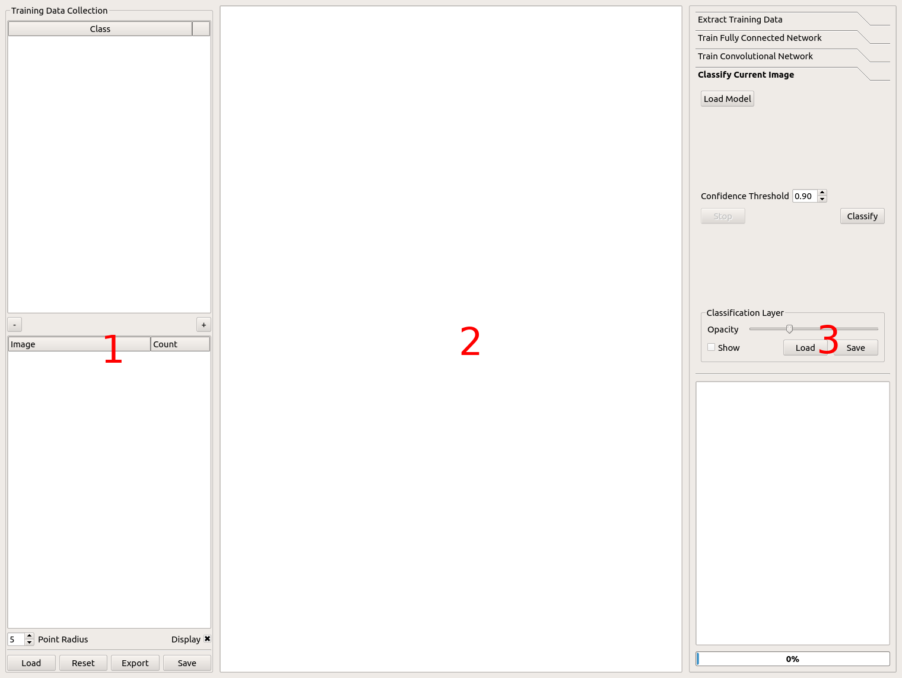

====================================================
Neural Network Image Classifier (Nenetic) User Guide
====================================================

Introduction
============
The Neural Network Image Classifier (Nenetic) is a tool to label image pixels into discrete classes to create a product such as a land cover map. The user interface is designed to facilitate a workflow that involves selecting training data locations, extracting training data using original image and computed features, building models, and classifying images. 

Download and install Nenetic
Nenetic is a Python 3 program and can be downloaded from a GitHub repository: https://github.com/persts/Nenetic. Before running Nenetic you must first install the following:

To run Nenetic open a terminal window and navigate to the Nenetic directory with the file “main.py”. In the terminal window type “python3 main.py” to launch the Nenetic application. 

Nenetic user interface
======================
The graphical user interface is divided into three panes:

1. Training data collection
---------------------------
- Class manager: Add, remove, rename, and set display color for classes
- Point summary: Displays total points by class per image
- Load, save, export

2. Current image: Current image used to select training points and for classification
-------------------------------------------------------------------------------------
3. Model toolkit
----------------
- Training data extraction tool
- Train fully connected network
- Train convolutional network
- Classify image
- Status updates: Feedback and progress information

Nenetic GUI panes

Training Data Collection
============================
Before training a model, data need to be collected.  Nenetic has a set of tools that allow the user to select image pixels which are used as the reference point for extracting features to train a model. 

Class legend
----------------
The class legend pane is used to add classes (e.g., land cover class labels) and specify the color used to highlight labeled pixels on an image.

- To add classes click the “+” button in the lower-right corner of the pane. 
- To remove a class select the class by clicking on the class label then click on the “-” button. 
- To edit the class label double-click on the label then edit the text. If the new class label is the same as an existing label the two classes will be merged.
- To change the display color for a class double-click on the color square and use the “Select Color” window to adjust the color that will be used display points for that class.
 
Note that when selecting points on an image the points belonging to the active class will always be colored yellow

Point summary
-----------------
This pane displays the number of training points selected by class for each image being used to collect training data.

- To change the displayed point size enter a value from a 1 (diameter of three pixels) pixel to 25 or click the up and down arrows on the spin box. This value only affects the displayed points. 
- You can hide and display training points using the “Display” checkbox. 
- If you have more than one image in your collection, you can double click the image name to make that image the current image. Current image is displayed in bold.
      
Load, Save, Export
----------------------

- You can save point data with the “Save” button so the saved file can be loaded at another time using the “Load” button. 
- You can also “Export” a three-column CSV file that contains the point location (x, y using image coordinates) and the class label for each point. The CSV file can be used to import your point data into another application. 
- You can also “Reset” the training data if you want to start over. If you reset you will loose all of the points and the training legend information that is loaded. Using “Reset” does not modify the saved file unless you click “Save” after hitting “Reset” and overwrite your original point file. 

Current image
=================
This pane is used to display an image for collecting training data or to display the predicted classification on an image.

- To load an image,  drag it from your file manager into the current image pane. If you have previously saved training points and you use the “Load” feature the image will be loaded automatically.  
- To zoom, move the mouse wheel forward and back to zoom in and zoom out or use the pinch and stretch gesture on the track pad. 
- To pan around the image left-click on the image and move the mouse to pan the image. 
- To add a training point select the class you want to use in the Training Legend pane then press and hold the “Ctrl” key and either a right or left-click to add a single point under the cursor. To collect multiple points using streaming mode press and hold the   “Alt”  and while you move the mouse (no clicking required) a stream of points will be collected from under the cursor. 
- To remove points from the hold the “Shift” key then press the left mouse button to drag a box around the points to select the points you want to delete. Once the points are selected press the “Delete” key to remove the points from the training data set. 

Hot Keys
------------
	“d” toggle the points
	“c” toggle the classified image
	"r" to relabel selected points to the active class

Toolbox
===========
This pane is designed with a workflow started at the top tab and working your way down. Each tab is explained below. 

Training data extraction tool
---------------------------------
After collecting training points click on the “Extract Training Data” tab. In this tab there are two sub-tabs, “Layers” where you can set variables to include in the training data and “Layer Descriptions” with information about the variables. There are several features that can be calculated from the image bands.

Average:
........
The Average feature has an option to set the kernel characteristics and if all of the pixels in the square kernel should be used (“Solid Kernel”) to calculate an average or if only pixels directly above, below, left of and right of the center pixel should be used. Selecting “Average”  will create K new images by convolving an average kernel over the original image. The base kernel is 3 x 3 (e.g., K = 1) and expands by two pixels for each additional kernel. If K = 2, then a 3 x 3 and a 5 x 5 kernel will be used to generate two new images that will be added to the original image layers and any other feature layers that are selected. 

In addition to “Average” there are several indices that can be calculated from the original RGB image. If using a 4-band image these would only be appropriate if the first three bands are red, green, blue in that order. The algorithms used for each index are listed in the “Layer Descriptions” sub-tab.

RGB Indices:
............
- VNDVI = (G - R) / (G + R)
- GLI = (2 * G - R - B) / (2 * G + R + B)
- Lightness = max(RGB) + min(RGB) / 2
- Luminosity = 0.21 * R + 072 * G + 0.07 * B
- RGBAverage = (R + G + B) / 3
- VARI = (G - R) / (G + R - B)

Vector or Raster:
.................
There is an option to create a “Vector” (S x V) or “Raster” (S x N x N x V) representation of the training data where S is the number of samples or training points, N is the size of the “window” and V is the number of values/variables for each sample.  Vector data is for use with fully connected networks and Raster is for use with convolutional neural networks. The “Vector” option provides the option to specify the size of a square window that specifies how many pixels are included in a vector for a specific pixel. For example, if “N x N” is 1 then DN values for a single pixel are used. If “N xN” is 3 then the values for 9 pixels (3 x 3) will used, greatly increasing the size of the training vector for each training point. Selecting Raster uses a square image patch which will be used to train a convolution neural network (CNN). The dimensions of the patch is defined using the “N x N” variable. 

There is a checkbox with the option to use a JSON format to store training data which might be helpful for other applications but it is not recommend for general use as the file size can get extremely large greatly impacting the read and write times of the training data. 

Clicking on the “Extract” button opens a “Save Training Data” window where you can specify where the training data file should be saved. Progress is displayed in the status pane. The new file will have a “.p” extension for Python pickle formats and “.json” for JSON formats. 

Train Fully Connected Network
---------------------------------
This tab is used to set the parameters to train a fully connected neural network using vector training data saved from the “Extract Training Data” tab. Click the “Select Training Data” button to select the vector training file saved from the previous step. Summary information about the training data set will be displayed. Set the parameters for the model training using the “Epochs”, “Learning Rate”, “Batch Size”, L1 Hidden Nodes”, L2 Hidden Nodes”, and Validation Split” variables. Details on each of these variables is beyond the scope of this guide since some knowledge of using neural networks is required. To train a model click on the “Train” button. This will open the “Save Model To Directory” window where you need to specify a directory to store the model and supporting files. In most cases you will specify an existing empty or create a new directory using the “Create Folder” button. When creating a new directory enter the directory name then hit the “Enter” key before clicking on the “Open” button. Progress as well as accuracy and loss information is provided in the status pane. A set of files that define the model will be created in the designated directory.

Train Convolutional Network
-------------------------------
This tab is used to set the parameters to train a convolutional neural network using raster training data saved from the “Extract Training Data” tab. Click the “Select Training Data” button to select the raster training file saved from the previous step. Summary information about the training data set will be displayed. Set the parameters for the model training using the “Epochs”, “Learning Rate”, “Batch Size”, “Fully Connected Layer Size” and “Validation Split” variables. The “Validation Split” variable determines the percentage of training patches that will be set aside for validation. Details on the other variables is beyond the scope of this guide since some knowledge of using neural networks is required but a brief description of the variables is:

- conv2d, filter_count, filter_size: This will create a convolution layer based on the number of filters requested which will all have the same filter size. So conv2d, 10, 3 will created a convolution layer with 10 3x3 filters .

- Conv2d_135, filter_count: Creates a convolution layer that concatenates N (filter_count) 1x1, 3x3, 5x5 filters. Conv2d_135, 5 will create a convolution layer with an output dimension on y, x, 15 (1x1x5, 3x3x5, 5x5x5)

- Conv2d_135_reduce, filter_count: acts just like conv2d_135 but the 3x3 and 5x5 each have a 1x1 layer before them which reduces the parameters of the overall network among other things. This concept is based on the Inception module. 

- max_pool: Creates a max pooling layer with a stride of 2 and size of 2, which will decrease the previous layer dimensions by 2

To train a model click on the “Train” button. This will open the “Save Model To Directory” window where you need to specify a directory to store the model and supporting files. In most cases you will specify an existing empty directory or create a new directory using the “Create Folder” button. When creating a new directory enter the directory name then hit the “Enter” key before clicking on the “Open” button. Progress as well as accuracy and loss information is provided in the status pane. A set of files that define the model will be created in the designated directory.

Classify Current Image
--------------------------
Use this tab to classify the displayed image.  First click “Load Model” to specify which model will be used to classify the image. The “Confidence Threshold” box is used to enter the percent confidence threshold, below which pixels will be assigned a no-data value of 0. YWhen the parameters are set click the “Classify” button to start the classification process. Progress is displayed in the status pane. 

As the classification is running and after it is complete you can toggle the classified image on and off over the original image using the “Show” checkbox . You can also set the “Opacity” using a slider to control the transparency of the classified layer. You can save the classified image using “Save” button at the bottom of the pane. To load a classification image use the “Load” button. 

Status updates
------------------
This pane displays the status of each step in the work flow. At the bottom of the pane is a progress bar that can be used to estimate remaining time for a particular processing step. 

Helper scripts
==================
Additional python scrips have been created to import and merge training data. The current scripts include:
csv_import.py: Imports a CSV file with image coordinates and labels to define training data locations in an image. The file must have three fields; X coordinate, Y coordinate, and class number (lebel). The first line of the CSV file is skipped. Here is an example with the first three lines of a CSV file:
"x","y","classVector"
2228.5,1238.5,5
2229.5,1238.5,5

- **ilastik_export.py**:Exports a Nenetic training data point file (.pnt file extension) image to a BMP format image that can be imported into Ilastik. Usage: ilastick_export pnt_file_name
- **ilastik_import.py**: Imports a BMP training data file created using Ilastik to a .pnt file that can be input into Nenetic. The script requires the BMP image and the image that was used as the reference when collecting the training data in Ilastik. Usage: ilastik_import ilastik_export_bmp original_image_name
- **merge.py**: Merges multiple Nenetic .pnt files into a single file. The output merged file will be named “merged.pnt”. Usage: merge .pnt_1 .pnt_2 ... .pnt_n

Appendix:
===========

Citations and license information
---------------------------------
If you use Nenetic on data that result in a publication, report, or online analysis, we ask that you include the following reference: Ersts, P.E. 2018. Neural Network Image Classifier. American Museum of Natural History, Center for Biodiversity and Conservation. Available from https://github.com/persts/Nenetic. (accessed on the date).

Nenetic is free software: you can redistribute it and/or modify it under the terms of the GNU General Public
License as published by the Free Software Foundation, either version 3 of the License, or (at your option) any later
version.

Nenetic is distributed in the hope that it will be useful, but WITHOUT ANY WARRANTY; without even the
implied warranty of MERCHANTABILITY or FITNESS FOR A PARTICULAR PURPOSE. See the GNU General
Public License for more details.

You should have received a copy of the GNU General Public License along with with this software. If not, see
<http://www.gnu.org/licenses/>.

Any questions or comment related to this document should be sent to Ned Horning – horning@amnh.org.